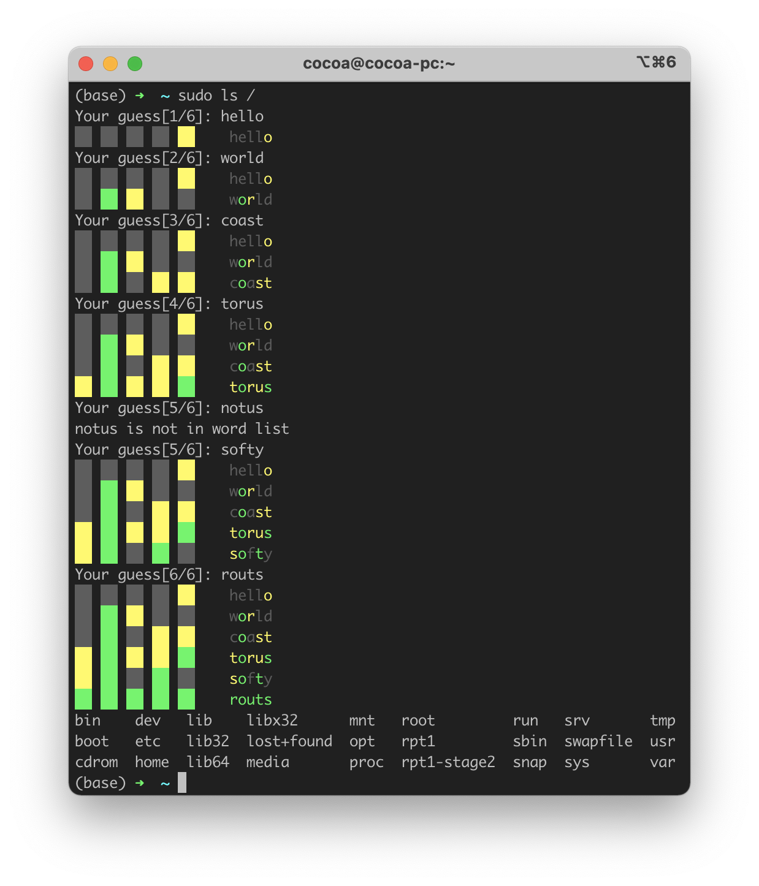

# pam_wordle

| OS               | arch    | Build Status |
|------------------|---------|--------------|
| Ubuntu 20.04     | x86_64  | [](https://github.com/cocoa-xu/pam_wordle/actions/workflows/linux-x86_64.yml) |

They say "practice makes perfect", and that is perhaps true.

So, let's practice more on the game, [wordle](https://www.powerlanguage.co.uk/wordle/), in a daily manner! UwU



## Dependency
- CMake >= 3.12
- C++ Compiler
- libpam0g-dev (or its equivalent on your system)

## Compile
```shell
git clone --depth=1 https://github.com/cocoa-xu/pam_wordle
mkdir -p build
cmake -DCMAKE_BUILD_TYPE=Release ..
make
```

## Installation
By default, Debian/Ubuntu puts pam modules in the `/lib/security` directory. But this may not be your case if the OS 
you're using checks pam modules from another location.

If you're using Debian/Ubuntu, or if your OS also uses the `/lib/security` directory for the pam modules, then 
```shell
sudo make install
```

Otherwise, please refer to the manual of your OS to find out where to put the `pam_wordle.so`.

## Enable pam_wordle.so
To enable `pam_wordle.so`, you need to open the `/etc/pam.d/sudo` file in your preferred editor, and add the following
line to it.  
```shell
auth    sufficient   pam_wordle.so
```

pam loads the modules in the order of their position in the `/etc/pam.d/sudo` file, i.e., if you put the `pam_wordle.so`
at the first line, then pam will first try to use this module to do authentication. 

If you failed to figure out the correct word, pam will continue to use other modules (e.g., fallback to password).

However, if you want some challenge, change the `sufficient` in the config to `required`, i.e.,

```shell
auth    required   pam_wordle.so
```

Now, if you failed to guess the correct word, you'll not be able to use `sudo`.
